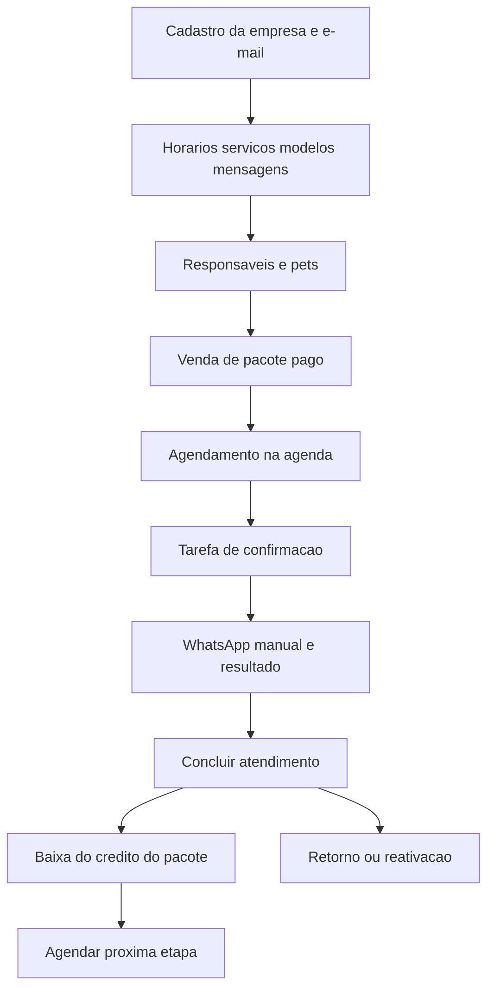

# Guia de uso do ClientLoop

Roteiro para usar o sistema **do zero** e percorrer todos os fluxos que o produto cobre hoje. Serve para treinar a operação e para conferir se as peças se conectam.

Há um resumo mais curto no painel, em **Como usar** (`/admin/how-to-use`). Este arquivo é o passo a passo completo.

O ClientLoop organiza agenda, pets, responsáveis, pacotes de banho/tosa e confirmações. O WhatsApp nesta versão é **manual**: o painel abre uma conversa `wa.me` e a pessoa da loja registra o resultado.

**Não é** clínica veterinária, hotel, loja de ração nem caixa (PDV).

---

## Mapa do produto



Entidades que você vai encontrar:

| No painel | O que é |
|---|---|
| Responsável | Pessoa com telefone WhatsApp (único por loja) |
| Pet | Animal ligado a um responsável |
| Serviço | O que você vende (Banho, Tosa, etc.), com duração |
| Modelo de pacote | Sequência de serviços vendida como combo |
| Pacote | Combinação **já vendida** para um pet (cópia do modelo) |
| Agendamento | Um horário na agenda, com ou sem pacote |
| Tarefa pendente | Contato que precisa ser feito no WhatsApp |
| Campanha | Gera várias tarefas de retorno ou reativação de uma vez |

O loop do produto: **agenda gera confirmação → você fala no WhatsApp → o atendimento gera crédito do pacote ou data de retorno → retorno gera nova conversa**.

---

## 0. Como entrar no sistema

Escolha um caminho.

### Caminho A — empresa nova (do zero)

1. Abra `/register` (também existe o atalho `/cadastro`).
2. Preencha nome da empresa, seu nome, e-mail e senha (**mínimo 12 caracteres**, com confirmação).
3. Confirme o e-mail (no Docker, o Mailpit fica em `http://localhost:8025`).
4. Depois da confirmação você cai em `/admin`.

Isso cria a empresa em período de teste, associa o plano padrão e o primeiro usuário. Os dados de uma loja **não misturam** com os de outra (`company_id`).

### Caminho B — dados de demonstração

Se o seed rodou (`php artisan migrate --seed` ou equivalente):

| Papel | URL | E-mail | Senha |
|---|---|---|---|
| Loja demo (Pet Shop Patinhas) | `/admin` | `demo@clientloop.test` | `clientloop123` |
| Superadmin da plataforma | `/platform` | `admin@clientloop.test` | `clientloop123` |

O que a demo já deixa pronto está no [apêndice](#apendice-a-o-que-a-demo-ja-cria).

### O que aparece na página inicial

Cards (clicáveis):

- **Agenda de hoje** — atendimentos do dia (exceto cancelados e faltas).
- **Tarefas pendentes** — confirmações, retornos e reativações a tratar.
- **Pacotes com pouco saldo** — pagos com 1 crédito ou menos.
- **Próximas etapas de pacote** — pacotes pagos que ainda têm visita.
- **Pacotes vencidos** — `Válido até` anterior a hoje.

Menu principal que você vai usar: **Como usar**, **Agenda**, **Pets**, **Responsáveis**, **Serviços**, **Pacotes**, **Campanhas**, **Horários de atendimento**, **Modelos de pacotes**, **Importações**, **Mensagens** (rótulos podem variar levemente; a lista de agendamentos e a fila de contatos também abrem pelos cards, porque não ficam no menu).

---

## 1. Preparar uma vez

Faça nesta ordem. Sem serviço e horário, a agenda não fecha o ciclo. Sem modelo, você não vende pacote. Sem mensagem, a tarefa de confirmação nasce sem texto pronto.

### Passo 1 — Horários de atendimento

Menu **Configurações → Horários de atendimento** (`/admin/business-settings`).

1. Marque os dias (padrão: segunda a sábado).
2. Informe início e fim do expediente (padrão: **9h às 17h**).
3. Salve.

Regras fixas nesta versão:

- Horários cheios de **60 em 60 minutos** (09:00, 10:00…).
- O atendimento **inteiro** precisa caber no expediente. Uma tosa de 120 minutos às 16h, com fechamento às 17h, é recusada.
- Dia fora da lista (ex.: domingo, se você não atende) é recusado.

A antecedência da confirmação (padrão **24 horas**) e os meses de reativação (padrão **6**) **não** se ajustam nesta tela. Isso fica no painel da plataforma (`/platform`), no cadastro da empresa.

### Passo 2 — Serviços

Menu **Serviços**.

Crie o que sua loja realmente faz. Exemplo coerente com a demo:

| Nome | Duração | Preço sugerido | Retorno (meses) |
|---|---|---|---|
| Banho | 60 | 45 | 1 (se quiser retorno automático) |
| Tosa | 120 | 80 | em branco, se não quiser |
| Banho com higiênico e hidratação | 60 | 55 | em branco ou 1 |

O **preço sugerido** é só referência. Não vira cobrança no agendamento.

O **retorno padrão (meses)** entra em jogo **depois de concluir** um atendimento **sem próxima etapa de pacote**. O sistema grava no responsável a data prevista (`Retorno previsto`). Deixe em branco se aquele serviço não deve disparar retorno sozinho.

Desative (`Ativo` desligado) serviços que você não quer mais oferecer: eles somem da lista ao criar agendamento.

### Passo 3 — Modelos de pacotes

Menu **Configurações → Modelos de pacotes**.

Exemplo “4 banhos”:

1. Nome: `4 banhos`.
2. Preço sugerido: `160`.
3. Sequência (cada linha = uma visita), na ordem:
   1. Banho
   2. Banho
   3. Banho
   4. Banho com higiênico e hidratação

A **próxima etapa** do pacote vendido é sempre o primeiro item da sequência que ainda não foi baixado. Você **não** escolhe “qualquer banho do pacote”: tem que ser o serviço da vez.

Marque **Disponível para venda**. Modelos inativos não aparecem na venda.

### Passo 4 — Mensagens prontas

Menu das mensagens (`/admin/message-templates`).

Crie pelo menos três, uma de cada tipo:

| Tipo no sistema | Quando entra |
|---|---|
| Confirmação | Um dia (24h) antes de um horário ainda não confirmado |
| Retorno | Cliente sem horário futuro e com data de retorno vencida |
| Reativação | Sem movimento há 6 meses (padrão) e sem horário futuro |

Texto de exemplo:

```text
Olá, {{responsavel}}! O banho de {{pet}} está marcado para {{data}} às {{horario}}. Podemos confirmar?
```

Variáveis permitidas: `{{responsavel}}`, `{{cliente}}` (mesmo valor), `{{pet}}`, `{{empresa}}`, `{{servico}}`, `{{data}}`, `{{horario}}`, `{{link_agendamento}}` (hoje sai **vazio**). Qualquer outra variável impede salvar.

O sistema pega o primeiro modelo **ativo** daquele tipo da loja. Se não houver modelo, a tarefa ainda pode ser criada, mas sem texto preenchido.

### Passo 5 — Responsáveis e pets

**Opção manual**

1. **Responsáveis**: nome e telefone (DDD + número; o sistema normaliza para Brasil / `+55`). Telefone é único na loja. Observações são livres. Deixe **Bloqueio de contato** vazio, salvo se a pessoa já pediu para não ser chamada.
2. Na ficha do responsável, aba **Pets deste responsável**, ou menu **Pets**: nome, espécie, raça, porte (pequeno/médio/grande), observações.

Um responsável pode ter vários pets. O agendamento sempre pede os dois: primeiro a pessoa, depois o animal dela. Pet de outro responsável não entra.

**Opção planilha** — veja o [fluxo de importação](#fluxo-importar-planilha-antiga).

---

## 2. Rotina do dia (caminho feliz)

Use este roteiro como primeiro teste completo. Depois rode as circunstâncias da seção 3.

### 2.1 Vender um pacote (se for o caso)

Menu **Pacotes** → criar:

1. Pet.
2. Modelo (só os disponíveis).
3. Valor cobrado (vazio = preço sugerido).
4. Situação do pagamento: **Pago** (só assim o pacote entra na agenda).
5. Data da venda.
6. **Válido até** (opcional). Vazio = sem validade.

Ao salvar, o sistema **copia** a sequência do modelo para aquele pet. Mudar o modelo depois **não** reescreve pacotes já vendidos.

### 2.2 Marcar o horário

1. Abra **Agenda** (`/admin/calendar`). Alterne dia/semana e a data.
2. Clique no horário livre (ou “Novo agendamento”).
3. Preencha nesta ordem: **Responsável → Pet → Serviço → Pacote (opcional) → data/hora**.
4. A duração copia a do serviço; você pode ajustar, mas o bloco inteiro precisa caber no expediente e não pode sobrepor outro horário ativo.
5. Salve. Situação inicial: **Agendado**.

O pacote só aparece se estiver **pago**, válido, com saldo e com **próxima etapa igual ao serviço** escolhido.

**O crédito ainda não baixa.** Marcar horário só reserva a agenda.

### 2.3 Confirmar no WhatsApp

Quando o horário entra na janela de confirmação (padrão: nas próximas 24 horas) e a situação ainda é **Agendado** (ou **Alteração solicitada**), o comando `clientloop:generate-tasks` cria uma tarefa de **Confirmação** (prioridade alta). No Docker isso roda de hora em hora; localmente você pode executar:

```sh
php artisan clientloop:generate-tasks
```

1. No dashboard, clique **Tarefas pendentes**.
2. Na linha: **Abrir WhatsApp** (nova aba `wa.me` com a mensagem já montada).
3. Depois da conversa: **Registrar resultado**.

| Resultado | Efeito no agendamento | Efeito na tarefa |
|---|---|---|
| Confirmou | Vai para **Confirmado** | Concluída |
| Pediu alteração | Vai para **Alteração solicitada** | Concluída |
| Agendou | Não muda o horário sozinho (use em retorno/reativação) | Concluída |
| Sem resposta | Continua **Agendado** | Concluída |
| Não receber contato | Opt-out no responsável; outras tarefas pendentes cancelam | Concluída |

A geração é **idempotente**: rodar o comando duas vezes não duplica a mesma confirmação daquele agendamento.

### 2.4 No dia: atender e concluir

Quando o serviço aconteceu, abra o agendamento (lista `/admin/appointments` ou o card na agenda) e clique **Concluir atendimento**.

Isso:

- Muda a situação para **Concluído**.
- Se havia pacote válido, **baixa 1 crédito** (uma vez só; concluir de novo não desconta outra vez).
- Atualiza **último movimento** do responsável.
- Se ainda existe próxima etapa no pacote, **zera o retorno previsto**.
- Se não há próxima etapa e o serviço tem meses de retorno, grava **Retorno previsto**.

Não é obrigatório ter confirmado antes: **Agendado → Concluído** é permitido.

### 2.5 Próxima visita do pacote

No mesmo registro concluído, se ainda há etapa: **Agendar próxima etapa**.

O formulário já vem com responsável, pet, **próximo serviço da fila**, o mesmo pacote e o **mesmo horário daqui a 7 dias**. Confira se aquele dia/hora está livre e dentro do expediente, e salve.

---

## 3. Circunstâncias da pet shop

Para cada bloco: situação → o que fazer → o que o sistema faz → o que **não** faz. Percorra todos se o objetivo é entender o produto.

### Fluxo: cliente novo, um pet, banho avulso

**Situação.** Ana chega com Thor. Não comprou pacote.

1. Cadastre Ana e Thor.
2. Na agenda, marque Banho **sem** pacote.
3. Confirme no WhatsApp (resultado **Confirmou**).
4. Conclua o atendimento.

**Esperado.** Thor toma banho. Saldo de pacote não muda (não havia). Se o serviço Banho tiver retorno em meses, Ana ganha **Retorno previsto**. Senão, o campo permanece vazio.

**Não acontece.** Não nasce “próxima etapa”. Preço do banho não vira conta a receber.

---

### Fluxo: um dono, dois pets

**Situação.** Mariana tem Amora e Pingo (como na demo).

1. Um responsável, dois pets.
2. Marque banho da Amora às 14h e, se couber, outro horário para Pingo.

**Esperado.** Cada agendamento é independente. Pacote da Amora **não** vale para Pingo.

**Não acontece.** Não existe “agendar a família inteira” num único bloco. A agenda da loja é **um horário por vez** (não há vários tosadores em paralelo nesta versão).

---

### Fluxo: pacote “4 banhos” sequencial

**Situação.** Ana compra 4 banhos para Thor: três banhos simples e o quarto com higiênico.

1. Crie o modelo com essa ordem.
2. Venda o pacote **pago** para Thor.
3. Na agenda, escolha Banho + aquele pacote. Deve aparecer “próxima etapa: Banho”.
4. Tente marcar o mesmo pacote com **Tosa** ou com **Banho com higiênico** na primeira visita.

**Esperado.** Só o serviço da posição 1 entra. Depois de concluir, a próxima etapa vira o item 2. Na quarta visita, só o higiênico casa com o pacote.

**Não acontece.** Não dá para “queimar” o higiênico no primeiro dia usando o pacote.

---

### Fluxo: cliente paga depois

**Situação.** Carlos quer o pacote de 4 tosas da Mel, mas ainda não pagou.

1. Venda com pagamento **Pendente** (na demo, Mel já está assim).
2. Tente agendar Tosa **com** esse pacote.

**Esperado.** O pacote não aparece (ou a gravação é recusada). Você ainda pode marcar tosa **avulsa**, sem pacote.

3. Edite o pacote e mude para **Pago**.
4. Agende de novo com o pacote.

**Esperado.** Agora o pacote entra. Crédito só baixa ao **concluir**.

---

### Fluxo: tosa de 2 horas no fim do expediente

**Situação.** Expediente até 17h, tosa = 120 minutos.

1. Tente 16:00 — deve falhar (“termina fora do expediente”).
2. Tente 15:00 — deve passar (15:00–17:00).
3. Tente 09:00 e outro às 10:00 com 60 min no mesmo dia — o segundo deve falhar por **sobreposição**.
4. Tente 09:00 (120 min) e 11:00 (60 min) — deve passar (consecutivos).

**Esperado.** A loja não “encavala” dois animais no mesmo bloco de tempo. Não há fila de tosador A vs B: é **uma agenda**.

---

### Fluxo: pediram outro horário

Há dois jeitos.

**A — pela conversa de confirmação**

1. Registrar resultado **Pediu alteração**.
2. O agendamento fica **Alteração solicitada**.
3. Use **Reagendar** na lista de agendamentos, com o novo horário.

**B — direto no agendamento**

1. **Reagendar** enquanto a situação for Agendado, Confirmado ou Alteração solicitada.
2. O horário antigo some daquele slot; a situação volta para **Agendado**.
3. Tarefas de confirmação **pendentes** daquele horário são **canceladas** (resultado interno “reagendado”).
4. Quando o novo horário entrar na janela de 24h, nasce **outra** confirmação.

**Não acontece.** Não reagenda sozinho a partir do WhatsApp. Cancelado, concluído ou falta **não** reagendam.

---

### Fluxo: ninguém respondeu o WhatsApp

1. Na tarefa de confirmação, registre **Sem resposta**.

**Esperado.** Tarefa concluída. Agendamento **continua Agendado**. Você ainda pode concluir no dia, reagendar, ou confirmar depois (não pela mesma tarefa; ela já encerrou).

**Não acontece.** Não cancela o horário automaticamente. Não gera segunda confirmação para o mesmo agendamento (a chave é única).

---

### Fluxo: confirmou, mas ainda não veio

1. Resultado **Confirmou** → situação **Confirmado**.

**Esperado.** Some da fila de confirmação. Continua na agenda. No dia, **Concluir atendimento**.

**Não acontece.** Confirmar não baixa pacote e não marca retorno.

---

### Fluxo: faltou ou cancelou

Os estados **Não compareceu** e **Cancelado** existem. Saindo para eles, o horário **some da grade** da agenda (e do card “hoje”).

**Lacuna de interface:** não há botão “Marcar falta” nem “Cancelar horário” na lista. Dá para filtrar por essas situações, mas a mudança típica na tela do dia a dia é **Reagendar**, **Concluir** ou editar o registro.

Se você só apagar o agendamento, perde o histórico. Prefira entender isso como ponto frágil ao avaliar o produto: o domínio prevê falta/cancelamento; a operação diária quase não expõe isso.

**Pacote:** falta ou cancelamento **não** devem baixar crédito (o crédito só existe ao concluir).

---

### Fluxo: concluiu sem confirmar

Cliente chegou sem responder o WhatsApp.

1. Deixe o horário **Agendado**.
2. **Concluir atendimento**.

**Esperado.** Vai para Concluído. Pacote baixa se estava vinculado. Retorno segue as regras da seção 2.4.

---

### Fluxo: pacote acabou ou venceu

1. Use os 4 créditos (quatro conclusões) **ou** preencha **Válido até** no passado.
2. Tente agendar de novo com aquele pacote.
3. Olhe os cards **Pacotes com pouco saldo** e **Pacotes vencidos**.

**Esperado.** Pacote esgotado mostra “Pacote concluído” na coluna de próxima etapa. Vencido não é usável mesmo com saldo. Venda outro pacote ou atenda avulso.

**Não acontece.** Renovação automática. Transferência de saldo entre pets.

---

### Fluxo: “não me mande mensagem”

**Pelo WhatsApp (tarefa):** resultado **Não receber contato**.

**Pela ficha:** em Responsáveis, preencha **Bloqueio de contato** (só com pedido explícito).

**Esperado.** `opted_out_at` preenchido. Tarefas **pendentes** daquela pessoa cancelam. Novas tarefas do gerador **não** nascem (`can_contact` falso). WhatsApp some da fila.

Para voltar a falar: ação **Registrar novo consentimento** (obrigatório descrever como/quando autorizou). Sem esse texto, não reativa.

**Não acontece.** Opt-out não apaga pets nem agenda passada. Só para o contato ativo.

---

### Fluxo: cliente sumiu (6 meses ou mais)

**Situação.** João não traz o Bob há 9 meses (demo). Sem horário futuro.

1. Rode `php artisan clientloop:generate-tasks`.
2. Deve aparecer tarefa **Reativação**.
3. Ou crie **Campanha** tipo Reativação, escolha o modelo de mensagem, **Ativar campanha**.

**Esperado.** Campanha só pega quem tem último movimento antigo, sem opt-out e sem horário futuro. Cada pessoa entra uma vez na campanha. Quem não pode receber (opt-out ou cota) é marcado como ignorado na campanha.

**Não acontece.** Disparo automático pelo WhatsApp. A campanha só **enfileira** tarefas iguais às outras.

---

### Fluxo: hora de voltar (banho avulso)

1. Cadastre Banho com retorno de 1 ou 2 meses.
2. Conclua um banho **sem** pacote ativo restante.
3. Confira **Retorno previsto** no responsável (ou ajuste manualmente em **Ajustar retorno previsto**).
4. Avance o calendário mentalmente / rode o gerador quando a data chegar.
5. Tarefa **Retorno**, ou campanha tipo Retorno (filtro 3 / 6 / 12 meses).

**Esperado.** Quem já tem horário futuro **não** entra em retorno nem reativação.

Se, no meio do caminho, a pessoa **compra um pacote e você conclui uma etapa**, o retorno previsto **some** até o pacote acabar — o sistema assume que o próximo banho já está “dentro” do pacote.

---

### Fluxo: pacote ativo “segura” o retorno

1. Responsável com retorno já vencido.
2. Venda pacote pago, agende a próxima etapa, **conclua**.

**Esperado.** `next_return_at` fica vazio enquanto existir próxima etapa. Quando a última visita do pacote for concluída, o retorno volta a ser calculado pelo serviço daquela visita, se ele tiver meses configurados.

---

### Fluxo: importar planilha antiga

Menu **Configurações → Importações**.

1. Baixe o modelo CSV (rota autenticada `/admin/imports/template/...`).
2. Colunas usadas: nome do responsável, telefone, nome do pet; opcionais: último atendimento, retorno previsto, flag de não receber contato. Cabeçalhos antigos de “cliente” ainda são aceitos no mapeamento.
3. Envie o arquivo, associe cada campo à coluna, inicie.
4. A importação entra na **fila**. Acompanhe o histórico na mesma tela. Erros vêm **por linha** (ex.: telefone inválido).

**Esperado.** Cria responsável + pet. Não importa agenda, pacotes nem serviços.

**Não acontece.** Se o arquivo sumir do disco, o lote falha com mensagem clara para reenviar — sem stack técnica na tela.

---

### Fluxo: cota do plano

Cada plano limita **responsáveis no mês** e **tarefas no mês**.

1. No `/platform`, veja ou edite o plano (contatos / tarefas).
2. Estourar responsáveis bloqueia novo cadastro com mensagem de limite.
3. Estourar tarefas: o gerador **simplesmente não cria** a tarefa; a campanha recusa se o lote inteiro não couber.

Uso é por mês calendário (`YYYY-MM`).

---

### Fluxo: duas lojas (isolamento)

1. Cadastre outra empresa em `/register` (outro e-mail).
2. Entre no `/admin` dessa conta.

**Esperado.** Agenda, pets e pacotes vazios. Nada da Patinhas aparece.

Vários usuários da **mesma** empresa compartilham os mesmos dados (nesta versão todos os usuários da loja entram no painel da empresa; o superadmin é outro painel).

---

### Fluxo: campanha de retorno em lote

1. Crie campanha tipo **Retorno**, modelo de mensagem do tipo retorno, opcionalmente “retornos dos últimos 3/6/12 meses”.
2. Deixe início vazio para começar agora, ou agende.
3. **Ativar campanha** (só em rascunho; depois não edita).

**Esperado.** Status **Ativa**, destinatários criados, tarefas na fila. Quem já estava na campanha não duplica.

---

## 4. Como as coisas se conectam

```text
Modelo de pacote  ──copia──►  Pacote do pet  ──vincula──►  Agendamento
Serviço  ──duração──►  Agenda (bloqueio de horário e expediente)
Agendamento (agendado) + 24h  ──gerador──►  Tarefa confirmação  ──wa.me──►  Resultado
Concluir  ──►  crédito do pacote  e/ou  retorno no responsável
Retorno/inatividade  ──gerador ou campanha──►  Tarefa  ──►  novo agendamento
Opt-out  ──►  para toda a fila daquela pessoa
```

Leitura honesta:

- **Faz sentido** para pet shop pequena de banho e tosa, que já fala no WhatsApp do celular, vende pacote de visitas e sofre com “não confirmou” e “sumiu 6 meses”.
- O pacote é uma **fila pré-paga de serviços**, não estoque e não caixa.
- A campanha é a **mesma tarefa**, em lote.
- O gerador evita duplicar (chave por agendamento / ciclo de retorno / mês de reativação).

### Isso faz sentido? O que esta versão não cobre

De propósito (não busque na interface):

- PDV, ração, estoque, comissão
- Hospedagem / creche
- Vacina, receita, prontuário clínico
- Vários tosadores no mesmo horário
- PIX, maquininha, boleto, nota fiscal
- API oficial de WhatsApp (envio automático)
- Link de autoagendamento (`{{link_agendamento}}` vazio)
- Conta a receber por atendimento (preço do serviço é sugestão)
- Antecedência de confirmação e meses de reativação **pela loja** (só `/platform`)
- Botões óbvios de falta e cancelamento, embora os estados existam

Se o seu teste era “vender shampoo + banho + hospedagem no feriado”, o produto **não** vai fechar esse ciclo. Se o teste era “Thor de 15 em 15 dias no pacote, confirmar ontem, baixar crédito só quando sair molhado”, o ciclo fecha.

---

## 5. Glossário

Alinhado à tela **Como usar**:

| Palavra | Significado |
|---|---|
| Responsável | Quem cuida do pet e recebe mensagem |
| Pet | Quem recebe o serviço |
| Pacote | Sequência de visitas já comprada |
| Próxima etapa | Serviço obrigatório da próxima visita daquele pacote |
| Saldo | Visitas que ainda podem ser baixadas |
| Agenda | Horários do dia ou da semana |
| Tarefas pendentes | Quem chamar no WhatsApp agora |
| Concluir atendimento | Confirma que o serviço aconteceu e libera crédito / retorno |

Situações do agendamento: Agendado → Confirmado ou Alteração solicitada → Concluído; também Cancelado e Não compareceu.

Situações da tarefa: Pendente, Concluída, Cancelada.

---

## Apêndice A — O que a demo já cria

Empresa **Pet Shop Patinhas**, expediente seg–sáb 9h–17h.

**Serviços:** Banho (60 min), Tosa (120 min), Banho com higiênico e hidratação (60 min).

**Pessoas e pets**

| Responsável | Telefone (demo) | Pets |
|---|---|---|
| Ana Beatriz Lima | 5511998765432 | Thor (cão, Shih-tzu, pequeno) |
| Carlos Eduardo Alves | 5511987654321 | Mel (cão, Labrador, grande) |
| Fernanda Souza | 5511976543210 | Nina (gato, Siamês, pequeno) |
| João Pedro Martins | 5511965432109 | Bob (cão, SRD, médio) — João inativo há ~9 meses |
| Mariana Oliveira | 5511954321098 | Amora e Pingo |

**Pacotes**

- Thor: **4 banhos**, pago, 1 crédito já usado (banho concluído no último dia útil).
- Mel: **4 tosas**, **pendente** — não dá para usar até pagar.
- Amora: **4 banhos**, pago, recente.

**Agenda** (datas relativas ao dia em que o seed rodou)

- Thor: banho 09:00 no **próximo** dia útil, agendado, com pacote; confirmação já na fila.
- Mel: tosa 11:00 no próximo dia útil, **confirmada**, **sem** pacote.
- Amora: banho 14:00 no próximo dia útil, agendado, com pacote; confirmação na fila.
- Nina: higiênico 10:00 no dia útil **seguinte**, confirmado.
- Thor: banho concluído no **último** dia útil, com baixa de crédito.

**Mensagens:** confirmação, retorno, reativação.

**Campanha rascunho:** “Pets para reativar”.

**Tarefa extra:** reativação do João/Bob já pendente.

Use a demo para pular o setup e ir direto aos fluxos: pagar o pacote da Mel, concluir o Thor e clicar **Agendar próxima etapa**, abrir WhatsApp da Amora, tratar o João.

---

## Apêndice B — Comandos e painel da plataforma

Gerar confirmações, retornos e reativações:

```sh
php artisan clientloop:generate-tasks
```

No Docker do projeto, o scheduler dispara isso **de hora em hora**. Só empresas `trial` ou `active`.

**Painel `/platform`** (superadmin): empresas (status, antecedência de confirmação em horas, meses de reativação) e planos (limites). Promover um usuário normal exige `users.is_super_admin = true` no banco, na fase inicial.

Lista de agendamentos: `/admin/appointments`.  
Fila de contatos: `/admin/contact-tasks` (também pelos cards).

---

## Apêndice C — Ordem sugerida para “andar o sistema inteiro”

Faça em um caderno o visto em cada linha. Dois dias fictícios de expediente bastam.

1. Registrar loja nova **ou** entrar na demo.
2. Conferir horários; criar/conferir os 3 serviços.
3. Criar modelo 4 banhos; criar as 3 mensagens.
4. Cadastrar um responsável + 2 pets **e** importar um CSV de 1 linha.
5. Banho avulso: agendar, gerar tarefas, confirmar, concluir, ver retorno.
6. Pacote pendente: tentar usar, falhar, pagar, usar.
7. Pacote sequencial: concluir etapa 1, agendar próxima, tentar serviço errado.
8. Tosa 16h (falha) e 15h (ok); dois horários sobrepostos (falha).
9. Reagendar; ver tarefa antiga cancelada; gerar de novo.
10. Sem resposta; concluir mesmo assim.
11. Opt-out; ver fila parar; novo consentimento.
12. Ajustar retorno / inatividade; gerar recall e reativação; ativar uma campanha.
13. Estourar (ou simular) cota se tiver plano apertado no `/platform`.
14. Abrir outra empresa e confirmar que a agenda está vazia.

Se algo dessa lista **não** puder ser feito pela tela, está documentado acima como lacuna (falta/cancelamento, WhatsApp automático, PDV). O restante fecha o ciclo que o ClientLoop se propõe a cuidar: **lembrar o próximo banho e a próxima conversa**.
